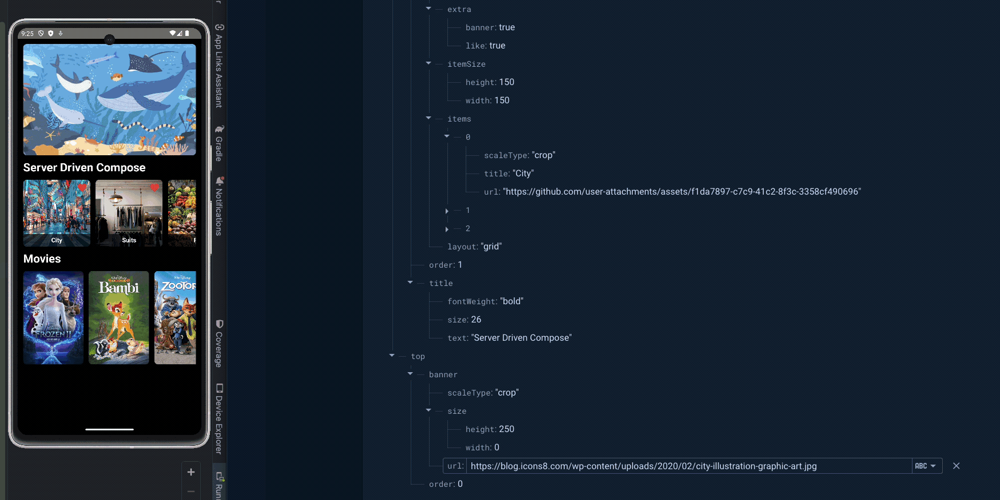
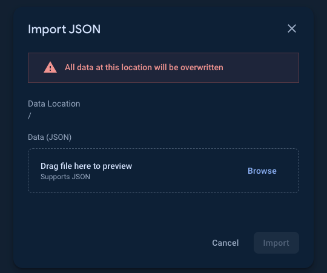
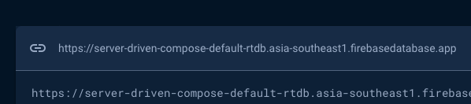

<h1 align="center">Server Driven Compose</h1>

<p align="center">
  <a href="https://opensource.org/licenses/Apache-2.0"></a>
  <a href="https://android-arsenal.com/api?level=21"></a>
  <a href="https://github.com/skydoves/server-driven-compose/actions"></a>
  <a href="https://github.com/skydoves"></a> 
</p>

<p align="center">
🧙 Server Driven Compose showcases server-driven UI approaches in Jetpack Compose with Firebase.
</p>

<p align="center">

</p>

## Tech stack & Open-source libraries
- Minimum SDK level 21.
- [Kotlin](https://kotlinlang.org/) based, utilizing [Coroutines](https://github.com/Kotlin/kotlinx.coroutines) + [Flow](https://kotlin.github.io/kotlinx.coroutines/kotlinx-coroutines-core/kotlinx.coroutines.flow/) for asynchronous operations.
- Jetpack Libraries:
  - Jetpack Compose: Android’s modern toolkit for declarative UI development.
  - Lifecycle: Observes Android lifecycles and manages UI states upon lifecycle changes.
  - ViewModel: Manages UI-related data and is lifecycle-aware, ensuring data survival through configuration changes.
  - Navigation: Facilitates screen navigation, complemented by [Hilt Navigation Compose](https://developer.android.com/jetpack/compose/libraries#hilt) for dependency injection.
  - [Hilt](https://dagger.dev/hilt/): Facilitates dependency injection.
- Architecture:
  - MVVM Architecture (View - ViewModel - Model): Facilitates separation of concerns and promotes maintainability.
  - Repository Pattern: Acts as a mediator between different data sources and the application's business logic.
- [Firebase Android KTX](https://github.com/skydoves/firebase-android-ktx): Kotlin & Compose-friendly Firebase extensions designed to help you focus on your business logic.
- [Retrofit2 & OkHttp3](https://github.com/square/retrofit): Constructs REST APIs and facilitates paging network data retrieval.
- [ksp](https://github.com/google/ksp): Kotlin Symbol Processing API for code generation and analysis.
- [Landscapist Glide](https://github.com/skydoves/landscapist#glide), [animation](https://github.com/skydoves/landscapist#animation), [placeholder](https://github.com/skydoves/landscapist#placeholder): A pluggable, highly optimized Jetpack Compose and Kotlin Multiplatform image loading library that fetches and displays network images with Glide, Coil, and Fresco.

## Runing This Project on Your Side

1. First things first, download the following JSON file on your local PC: [Gist: JSON demo for Timeline UI](https://gist.github.com/skydoves/16267ebe987c6246d917814440f03aac).

</details>

2. Following the [Firebase setup guidelines](https://firebase.google.com/docs/android/setup), download the **google-services.json** and place it into the `app` directory on this project.

3. Next, set up the [Firebase Realtime Database](https://firebase.google.com/docs/database) in your Firebase dashboard. Once that's done, you can import the JSON file like the image below:



4. Next, create a file named `secrets.properties` in the root directory of this project, and copy & paste your Realtime Database URL into it, as shown in the example below:



```
REALTIME_DATABASE_URL=https://server-driven-compose-default-rtdb.asia-southeast1.firebasedatabase.app/
```

5. Build the project.

## Architecture
**Server Driven Compose** adheres to the MVVM architecture and implements the Repository pattern, aligning with [Google's official architecture guidance](https://developer.android.com/topic/architecture).

The architecture of **Server Driven Compose** is structured into two distinct layers: the UI layer and the data layer. Each layer fulfills specific roles and responsibilities, outlined as follows:

**Server Driven Compose** follows the principles outlined in the [Guide to app architecture](https://developer.android.com/topic/architecture), making it an exemplary demonstration of architectural concepts in practical application.

### Architecture Overview


- Each layer adheres to the principles of [unidirectional event/data flow](https://developer.android.com/topic/architecture/ui-layer#udf): the UI layer sends user events to the data layer, and the data layer provides data streams to other layers.
- The data layer operates autonomously from other layers, maintaining purity without dependencies on external layers.

This loosely coupled architecture enhances component reusability and app scalability, facilitating seamless development and maintenance.

### UI Layer


The UI layer encompasses UI elements responsible for configuring screens for user interaction, alongside the [ViewModel](https://developer.android.com/topic/libraries/architecture/viewmodel), which manages app states and restores data during configuration changes.
- UI elements observe the data flow, ensuring synchronization with the underlying data layer.

## Modularization

**Server Driven Compose** adopted modularization strategies below:

- **Reusability**: Modulizing reusable codes properly enable opportunities for code sharing and limits code accessibility in other modules at the same time.
- **Parallel Building**: Each module can be run in parallel and it reduces the build time.
- **Strict visibility control**: Modules restrict to expose dedicated components and access to other layers, so it prevents they're being used outside the module
- **Decentralized focusing**: Each developer team can assign their dedicated module and they can focus on their own modules.

For more information, check out the [Guide to Android app modularization](https://developer.android.com/topic/modularization).

## Find this repository useful? :heart:
Support it by joining __[stargazers](https://github.com/skydoves/server-driven-compose/stargazers)__ for this repository. :star: <br>
Also, __[follow me](https://github.com/skydoves)__ on GitHub for my next creations! 🤩

# License
```xml
Designed and developed by 2024 skydoves (Jaewoong Eum)

Licensed under the Apache License, Version 2.0 (the "License");
you may not use this file except in compliance with the License.
You may obtain a copy of the License at

   http://www.apache.org/licenses/LICENSE-2.0

Unless required by applicable law or agreed to in writing, software
distributed under the License is distributed on an "AS IS" BASIS,
WITHOUT WARRANTIES OR CONDITIONS OF ANY KIND, either express or implied.
See the License for the specific language governing permissions and
limitations under the License.
```